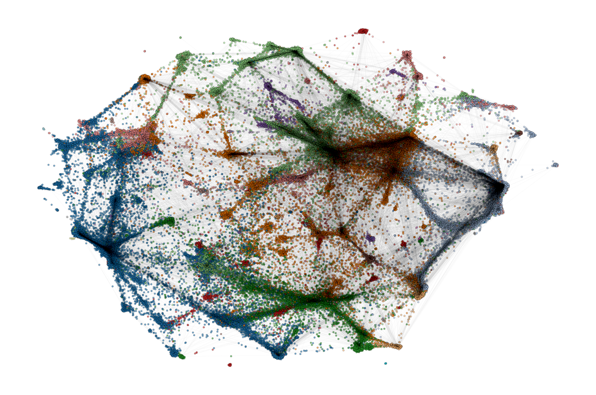

| **Author**  | **Project** | **License** |
|:-----------:|:-----------:|:-----------:|
| [**Alessandro Lapi**](https://github.com/ale-lapi) | **PubMed Citation Network** | [](https://github.com/ale-lapi/Pubmed-Citation-Network/tree/master/LICENSE)|


# PCNet

## PubMed Citation Network

**PCNet** is a Python package that allows researchers to create *citation networks* using scientific publications sourced from the *PubMed* database. Leveraging the vast collection of biomedical literature available in PubMed, this tool enables users to explore the relationships and connections between scientific articles in their research area.


- [Overview](#overview)
- [What's included](#whats-included)
- [Installation](#installation)
- [Data](#data)
- [Usage](#usage)
- [Testing](#testing)
- [License](#license)




This graph represents the citation network of Covid-19 publications until December 2022, generated using this tool. The colors within the graph correspond to the communities identified through the application of the Louvain community algorithm in the *networkx* library.

## Overview

**Citation network analysis** studies the connections between scientific articles through their citations. It helps researchers review the literature, assess research impact, understand knowledge diffusion, map collaborative networks, and identify emerging research areas within a field. Citation network analysis can reveal valuable information about the structure, dynamics and patterns of a specific field.

**PubMed** is a widely used online database that provides access to a large collection of biomedical literature. Developed and maintained by the *National Center for Biotechnology Information* (NCBI), PubMed contains millions of citations and abstracts from a wide range of sources, including scientific journals, conference proceedings, and books, covering fields such as medicine, biology, pharmacology, genetics, and more. 

Using the **PCNet**, researchers can effortlessly retrieve publication metadata, including article titles, abstracts, publication dates, authors, journal, keywords directly from PubMed. Once the desired publications are obtained from PubMed, the tool facilitates the construction of a citation network. It identifies the citations within the retrieved articles and establishes the corresponding connections between them. The resulting graph representation can be analysed using *networkx* functions or other softwares like *Gephi*, allowing researchers to gain a comprehensive understanding of the citation relationships and patterns within their field of interest.

It is important to note that the analysis of the network necessitates an additional step, which is beyond the scope of this particular tool.


## What's included

Repository structure:
```text
PCNet/
├──data/
|   ├──csv/
|   ├──graph/
|   ├──pubmed/
|   └──test/
├──docs/
|   └──pcnet.pdf
├──examples/
|   └──PCNet_notebook.ipynb
├──PCNet/
|   ├──__init__.py
|   ├──PCNet_network.py
|   └──PCNet_parser.py
├──test/
|   └──test_PCNet.py
├──configuration.ini
├──requirements.txt
└──setup.py
     
```

 - [`data`](data)
    - [`csv`](data/csv): folder where csv files created after the parse are saved
    - [`graph`](data/graph): folder where the graph created through the tool is saved
    - [`pubmed`](data/pubmed): folder where you should put data downloaded from the PubMed baselline as specified [here](#data)
    - [`test`](data/test): folder where you can find some files for testing the tool

- [`docs`](docs)
    - [`pcnet.pdf`](docs/pcnet.pdf): documentation of the package in .pdf

- [`PCNet`](PCNet)
    - [`PCNet_network.py`](PCNet/PCNet_network.py): python file that produce the graph according to the settings specified in [configuration.ini](configuration.ini). The graph will be saved in the [graph](data/graph) folder
    - [`PCNet_parser.py`](PCNet/PCNet_parser.py): python file which contain all the functions needed to achieve the goal

 - [`test`](data/test)
    - [`test_PCNet.py`](test_PCNet.py): python file containing all the test functions

 - [`examples`](examples)
    - [`PCNet_notebook.ipynb`](tutorial/PCNet_notebook.ipynb): notebook in which you can run the code piece by piece for a faster an and customizable implementation

 - [`configuration.ini`](configuration.ini): text file where you have to specify your setting preferences before running [PCNet_network.py](PCNet/PCNet_network.py)

 - [`requirements.txt`](requirements.txt): text file containing the list of necessary packages to run the tool

- [`setup.py`](setup.py): 


## Installation

To install the tool clone the repository [PCNet](https://github.com/ale-lapi/Pubmed-Citation-Network) and use pip:
```
git clone https://github.com/ale-lapi/PCNet
cd PCNet
```
Then install the requirements:

```
python -m pip install -r requirements.txt
```
Now you are ready to install the package:
```
python -m setup.py develop --user
```

Finally you are ready to import PCNet and its modules.

## Data

The website https://ftp.ncbi.nlm.nih.gov/pubmed/baseline/ hosts a valuable collection of data available for download related to the PubMed database. 
<!-- The dataset is provided in XML format and includes comprehensive bibliographic information, abstracts, author affiliations, and publication dates for scientific articles indexed in PubMed.  -->
The data is freely accessible to researchers, scientists, and anyone interested in studying or analyzing PubMed literature. The dataset is regularly updated to ensure the inclusion of the latest publications. Please note that the usage of data may be subject to specific terms and licensing agreements, which can be found on this [link](https://ftp.ncbi.nlm.nih.gov/pubmed/baseline/README.txt).

To use **PCNet** download the files with the *.gz* extention and put them in a folder (if you do not have any specific preferences put them in the [pubmed](https://github.com/ale-lapi/Pubmed-Citation-Network/tree/master/data/pubmed) folder). 

MD5 files are used to check the integrity of the file after the process of download. In this case they are not necessary.


## Usage

In [docs](docs) you can find the documentation file where you can find details about the functions of the package.

In order to build citation networks with **PCNet** you can follow the next instructions.

After [installation](#installation) and [data download](#data), there are two ways to use **PCNet** tool: using the [PCNet_network.py](PCNet/PCNet_network.py) python file or the [PCNet_notebook.ipynb](tutorial/PCNet_notebook.ipynb) notebook.

Python file:
- Set the configuration in the [configuration.ini](configuration.ini):
    - **mesh**: MeSH (Medical Subject Headings) is a controlled vocabulary used for indexing and organizing biomedical literature. To search for MeSH related to a certain topic, you can use the [MeSH Browser](https://meshb.nlm.nih.gov/search) provided by the National Library of Medicine (NLM).

        If ```mesh = ''``` the parse will be performed over all the articles;

    - **term_mesh**: it is the word corresponding to the MeSH. 
        It will be used to save the graph as *term_mesh*.gexf.
        
        If ```term_mesh = ''``` the graph will be saved as *pubmed*.gexf.

    - **info**: it is a list containing the information you want to extract with the parse. They will be added to the    nodes as attributes.

        By default it is ```info = ['title', 'abstract', 'date', 'authors', 'journal', 'keywords']```, i.e. all the possible information. 

        *PMID* and *References* are always extracted through the parse since they are necessary to create the graph.
        
        If you need less information you can modify the list. Note: the order of the words in the list is important.

    - **connected**: it is a boolean variable.

        If ```connected = True``` the graph will be connected, which means that will be kept only the largest connected component of the graph.

    - **keep_unknown_nodes**: it is a boolean variable.

        If ```keep_unknown_nodes = False``` the graph will contain only the nodes whose informations are known because the related articles were parsed.

        If ```keep_unknown_nodes = True``` the graph will contain all the nodes, including those of which we know only the *PMID* and the *citations*.


- From the root directory move into the package directory ([PCNet](PCNet)):

    ```cd PCNet```

    Then run the main function of the module [PCNet_network.py](PCNet/PCNet_network.py):

    ```python PCNet_network.py``` 

Notebook:
- You do not need any configuration file: each setting is chosen in the notebook.
- You can run single pieces of the code avoiding time consuming sections of the code you have already run. 


## Testing

The package is tested using [`pytest`](https://docs.pytest.org/en/latest/).
To install the package in development mode you need to add also this requirement:

* pytest

The python test script can be found [here](test/test_PCNet.py).


## License


This package is licensed under the [MIT "Expat" License](https://github.com/ale-lapi/Pubmed-Citation-Network/tree/master/LICENSE). 
